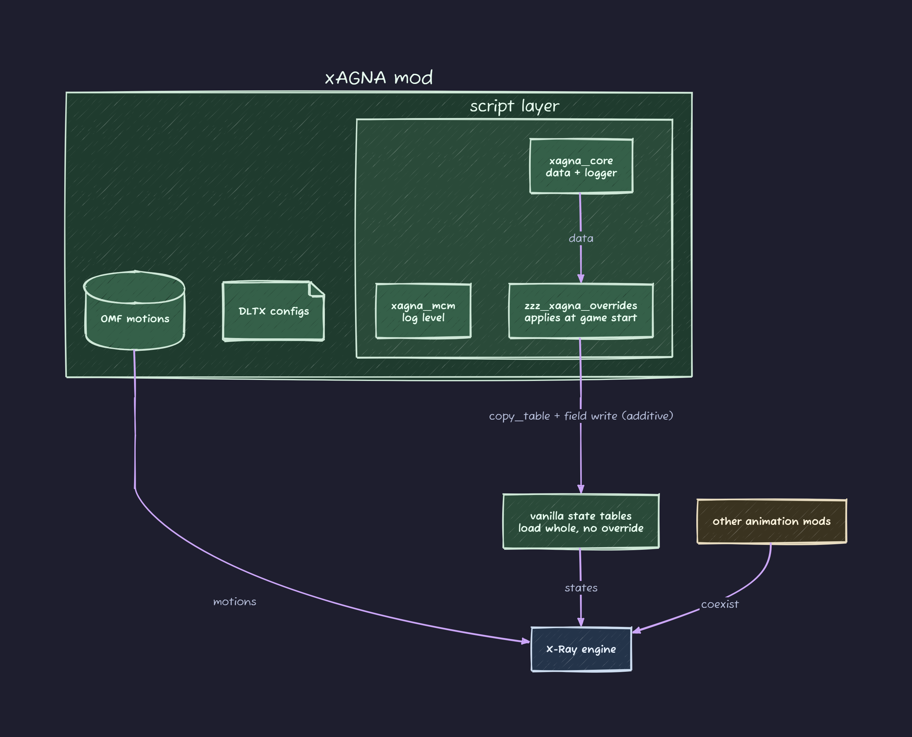

# xagna architecture

The script layer for the xAGNA NPC animation overhaul. It adds the mod's motions to the game additively and replaces no vanilla file.

## Files

`xagna_core.script` holds the kept animation entries, the PDA into-overlays, the standing-posture deltas, and the leveled logger.
`xagna_mcm.script` registers the MCM Log level control and sets the logger threshold from it.
`zzz_xagna_overrides.script` applies the edits at `on_game_start` and runs last so its edits win.

## How it works

The layer ships none of the three table overrides, so vanilla `state_lib`, `state_mgr_animation_list` and `state_mgr_scenario` load whole.
`copy_table` merges the kept entries into the animation table and a field write sets the standing postures.
No override means it coexists with other NPC animation mods and survives a base-game update.
The PDA and medical clips use xAGNA-only motions the mod's own OMF carries.
The logger writes to the xray log under the `[xagna]` prefix at the level the MCM Log level picks, WARN by default.
